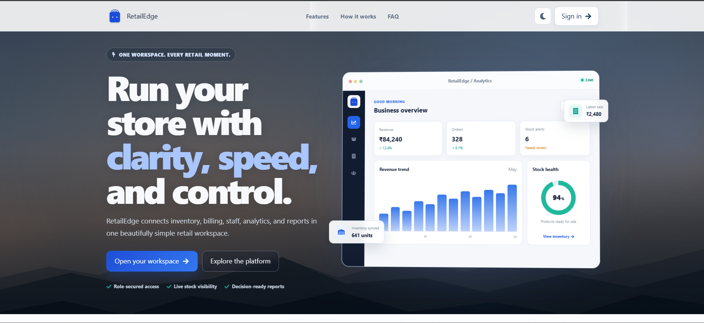
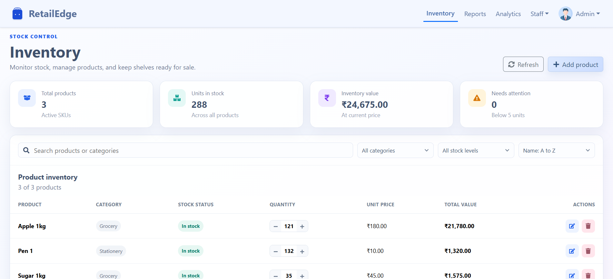
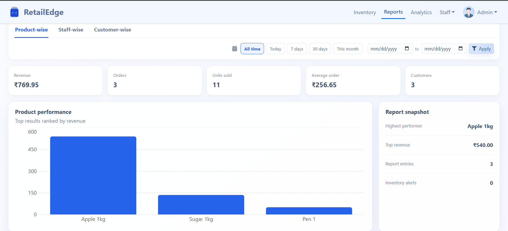

🛒 RetailEdge --- Retail Management System

{=html}

<b>{=html}One workspace for inventory, billing, staff, analytics, and
retail operations.</b>{=html}

<a href="#-features">{=html}Features</a>{=html} •
<a href="#-modules">{=html}Modules</a>{=html} •
<a href="#-tech-stack">{=html}Tech Stack</a>{=html} •
<a href="#-screenshots">{=html}Screenshots</a>{=html} •
<a href="#-installation">{=html}Installation</a>{=html}

📌 Project Overview

RetailEdge is a full-stack MERN-based retail management system built
to help shops manage their daily operations from a single platform.

The system focuses on inventory management, products, orders,
customers, staff, authentication, and business visibility through
dedicated dashboards.

The goal is to reduce manual work, improve stock visibility, and give
retail staff and administrators better control over day-to-day
operations.

✨ Features

📊 Business Dashboard --- View revenue, orders, stock health,
and key business metrics.

📦 Inventory Management --- Track products and available stock
in one place.

🛍️ Product Management --- Create, update, view, and manage
retail products.

🧾 Order Management --- Manage customer orders and order-related
information.

👥 Customer Management --- Maintain customer records and
information.

👨‍💼 Staff Management --- Manage staff-related operations from the
admin side.

🔐 JWT Authentication --- Secure login and authenticated API
access.

🛡️ Role-Based Access Control --- Different permissions for Admin
and Staff users.

📈 Analytics & Reports --- Provide useful business insights for
decision-making.

⚡ REST APIs --- Structured backend APIs for frontend/backend
communication.

🧩 Modules

Module                  Admin    Staff

Dashboard                ✅       ✅
Products                 ✅       ✅
Inventory                ✅       ✅
Orders                   ✅       ✅
Customers                ✅       ✅
Staff Management         ✅       ❌
User/Role Management     ✅       ❌
Analytics & Reports      ✅     Limited

🏗️ Architecture

                 ┌─────────────────────┐
                 │     React Frontend  │
                 │  Bootstrap + CSS     │
                 └──────────┬──────────┘
                            │
                         REST API
                            │
                 ┌──────────▼──────────┐
                 │   Node + Express    │
                 │  Business Logic     │
                 └──────────┬──────────┘
                            │
              ┌─────────────┴─────────────┐
              │                           │
       JWT Authentication            MongoDB
       Role Authorization             Database

🔐 Authentication & Security

RetailEdge uses JWT-based authentication to secure application routes
and APIs.

Authentication Flow

User Login
    ↓
Credentials Validation
    ↓
JWT Token Generated
    ↓
Token Sent to Client
    ↓
Protected API Request
    ↓
JWT Middleware
    ↓
Role Verification
    ↓
Authorized Response

This ensures that protected resources are accessible only to
authenticated users with the required permissions.

🛠️ Tech Stack

Frontend

React.js

Bootstrap

CSS3

JavaScript

Axios

Backend

Node.js

Express.js

REST APIs

JWT Authentication

bcrypt

Database

MongoDB

Mongoose

Tools & Deployment

Git & GitHub

Postman

Vercel

Render

📸 Screenshots

🏠 Landing Page

The landing page introduces RetailEdge and provides quick access to the
platform.

📊 Business Dashboard

The dashboard provides an overview of business performance, including
revenue, orders, stock alerts, and inventory health.

Add your dashboard screenshot here:

📦 Inventory Management

Add your inventory screenshot here:

🧾 Order Management

Add your orders screenshot here:

🚀 Installation

1. Clone the repository

git clone <your-repository-url>
cd RetailEdge

2. Install backend dependencies

cd backend
npm install

3. Configure environment variables

Create a .env file:

PORT=5000
MONGO_URI=your_mongodb_connection_string
JWT_SECRET=your_jwt_secret

4. Start backend

npm run dev

5. Start frontend

Open another terminal:

cd frontend
npm install
npm start

🧪 API Testing

APIs can be tested using Postman.

Example protected request:

GET /api/products
Authorization: Bearer <JWT_TOKEN>

📈 Project Highlights

Managed 1000+ inventory records

Improved stock and order management efficiency

Reduced unnecessary API response overhead

Implemented protected APIs using JWT

Implemented Admin/Staff role-based access

Built a centralized workspace for retail operations

🔮 Future Enhancements

🔔 Low-stock notifications

📱 Mobile-responsive staff interface

🧾 Invoice/PDF generation

📊 Advanced sales analytics

🏷️ Barcode scanning

📦 Supplier management

🤖 AI-based inventory forecasting

👨‍💻 Developer

Karan Talekar

MERN Stack Developer

⭐ If you like this project, consider giving the repository a star!
